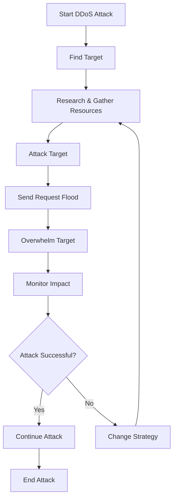

```mermaid
flowchart TD
    A[Start DDoS Attack] --> B[Find Target]
    B --> C[Research & Gather Resources]
    C --> D[Attack Target]
    D --> E[Send Request Flood]
    E --> F[Overwhelm Target]
    F --> G[Monitor Impact]
    G --> H{Attack Successful?}
    H -->|Yes| I[Continue Attack]
    H -->|No| J[Change Strategy]
    J --> C
    I --> K[End Attack]
```

