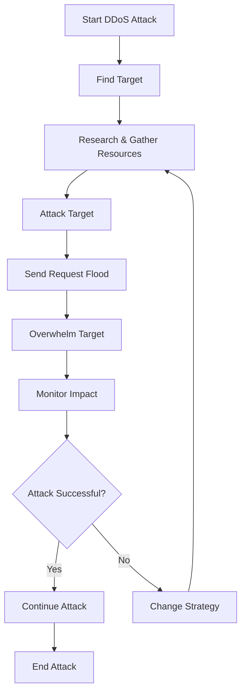

# DDos Attack Flowcharts
## Description
- DDos Attacks can be harmful towards websites as it can overload the target with many requests, forcing the website to go offline.
- This Mermaid Style Flowchart is a typical Sequence of what the attacker goes through to carry out the attack

